# Historical maps: Foster St & Sheridan Rd, Evanston

Historical aerial imagery covering the intersection of Foster St and Sheridan Rd in Evanston, on the west edge of the Northwestern University campus.

- **Input:** 42.05348569897312, -87.67721615228605 (aka Foster St & Sheridan Rd, Evanston)
- **Decimal (WGS84):** 42.053486, -87.677216
- **EPSG:3435:** 1162442, 1962764
- **Retrieved:** 2026-07-08

Evanston is outside Chicago, so the four Chicago-only map-sheet sources (Sanborn 1989 set, 80 Acres, Sidwell tax maps, water books) do not apply to this location; this collection is aerial imagery only.

## Files (oldest first)

| Year | Preview | Source | File | Notes |
|---|---|---|---|---|
| 1938 | [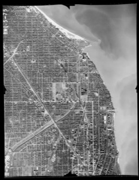](1938_ilhap_0bwq05075.jpg) | ISGS Illinois Historical Aerial Photography (ILHAP) | [`1938_ilhap_0bwq05075.jpg`](1938_ilhap_0bwq05075.jpg) | Flown 1938-11-20; frame center ~1,012 m from the intersection (nearest scanned frame) |
| 1970 | [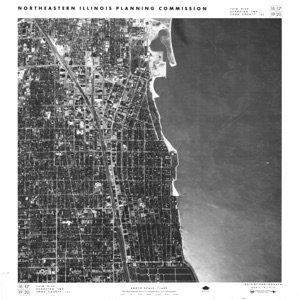](1970_cmap_4114_04.jpg) | CMAP/NIPC aerial | [`1970_cmap_4114_04.jpg`](1970_cmap_4114_04.jpg) | Tile 4114 photo 04; georeferenced via `.jgw` alongside |
| 1975 | [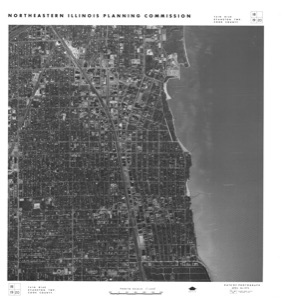](1975_cmap_4114_04.jpg) | CMAP/NIPC aerial | [`1975_cmap_4114_04.jpg`](1975_cmap_4114_04.jpg) | Tile 4114 photo 04 |
| 1980 | [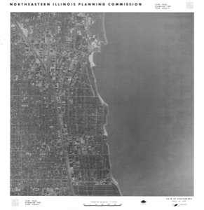](1980_cmap_4114_04.jpg) | CMAP/NIPC aerial | [`1980_cmap_4114_04.jpg`](1980_cmap_4114_04.jpg) | Tile 4114 photo 04 |
| 1985 | [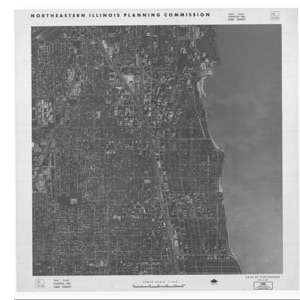](1985_cmap_4114_04.jpg) | CMAP/NIPC aerial | [`1985_cmap_4114_04.jpg`](1985_cmap_4114_04.jpg) | Tile 4114 photo 04 |
| 1990 | [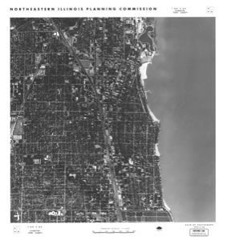](1990_cmap_4114_04.jpg) | CMAP/NIPC aerial | [`1990_cmap_4114_04.jpg`](1990_cmap_4114_04.jpg) | Tile 4114 photo 04 |
| 1995 | [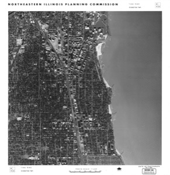](1995_cmap_4114_04.jpg) | CMAP/NIPC aerial | [`1995_cmap_4114_04.jpg`](1995_cmap_4114_04.jpg) | Tile 4114 photo 04 |
| 1998 | [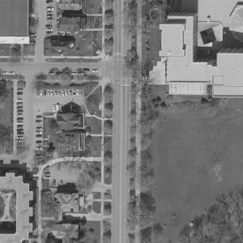](1998_cookortho.jpg) | Cook County ortho (CookOrthoPan1998) | [`1998_cookortho.jpg`](1998_cookortho.jpg) | Earliest county ortho, black & white (panchromatic); 600 ft square clip centered on the intersection |
| 2017 (survey 2017-06-10) | [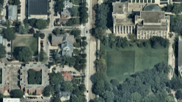](2017_nearmap_vertical.png) | Cook County Nearmap | [`2017_nearmap_vertical.png`](2017_nearmap_vertical.png) | Earliest Nearmap survey, vertical view |
| 2025 | [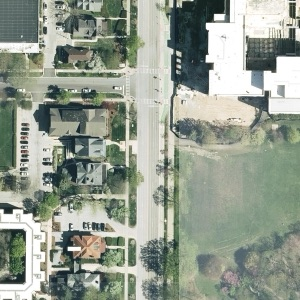](2025_cookortho.jpg) | Cook County ortho (CookOrtho2025) | [`2025_cookortho.jpg`](2025_cookortho.jpg) | Latest county ortho; 600 ft square clip centered on the intersection |
| 2026 (survey 2026-03-09) | [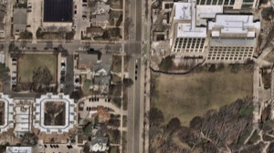](2026_nearmap_vertical.png) | Cook County Nearmap | [`2026_nearmap_vertical.png`](2026_nearmap_vertical.png) | Latest Nearmap survey, vertical view |

The `.jgw` world files alongside the CMAP aerials georeference each JPG (EPSG:3435) for use in GIS software.

## Not available / failed

- **Sanborn / 80 Acres / Sidwell / water books** — Chicago-only sources; not applicable in Evanston.
- **Nearmap oblique (bird's eye) views** — the directional buttons do not change the rendered view in the headless browser, so both Nearmap captures are vertical. View obliques manually at the [Cook County Nearmap viewer](https://maps.cookcountyil.gov/nearmapOpenlayers/?map=19.00/-87.677216/42.053486/0).

## Attribution

Sources: Cook County (ortho, Nearmap viewer), CMAP/NIPC (1970-1995 aerials), Illinois State Geological Survey (ILHAP 1938).
